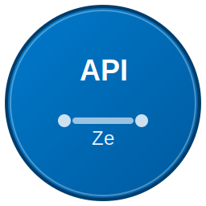

# ZeAPI - 专业的API测试工具

<div align="center">
  
  
  <p>基于 Electron 构建的跨平台 API 测试工具，支持 Android 应用打包</p>
  
  [](LICENSE)
  [](package.json)
  [](#)
</div>

## ✨ 特性

- 🚀 **现代化界面** - 基于 Electron 的原生桌面应用体验
- 📱 **跨平台支持** - Windows、macOS、Linux 和 Android 全平台覆盖
- 🔧 **完整的API测试** - 支持 GET、POST、PUT、DELETE 等所有 HTTP 方法
- 📁 **请求集合管理** - 组织和管理你的 API 请求
- 🌍 **环境变量** - 多环境配置，轻松切换开发、测试、生产环境
- 🧪 **测试脚本** - 内置测试脚本引擎，支持断言和自动化测试
- 📊 **响应分析** - 详细的响应数据展示和分析
- 💾 **数据持久化** - 本地存储，数据安全可靠
- 🔐 **多种认证方式** - 支持 Basic Auth、Bearer Token、API Key 等
- 📤 **导入导出** - 兼容 Postman、Insomnia 等主流工具

## 🚀 快速开始

### 环境要求

- Node.js 14.0 或更高版本
- npm 6.0 或更高版本
- 对于 Android 构建：Android SDK 和相关工具

### 安装依赖

```bash
# 克隆项目
git clone https://github.com/leemwood/zeapi.git
cd zeapi

# 安装依赖
npm install
```

### 开发模式

```bash
# 启动开发服务器
npm run dev

# 或使用构建脚本
node build.js dev
```

### 构建应用

```bash
# 构建当前平台
npm run build

# 构建特定平台
node build.js build windows
node build.js build macos
node build.js build linux
node build.js build android

# 构建所有平台
node build.js build all
```

## 📖 使用指南

### 基本操作

1. **创建请求**
   - 点击 "New Request" 按钮
   - 选择 HTTP 方法（GET、POST、PUT、DELETE 等）
   - 输入请求 URL
   - 配置请求参数、请求头、请求体等

2. **发送请求**
   - 点击 "Send" 按钮发送请求
   - 查看响应状态、响应头、响应体
   - 分析响应时间和大小

3. **保存请求**
   - 点击 "Save" 按钮保存当前请求
   - 为请求命名并选择保存位置
   - 创建文件夹组织请求

### 环境管理

1. **创建环境**
   - 在环境选择器中点击 "Manage Environments"
   - 添加新环境并设置变量
   - 在请求中使用 `{{variable}}` 语法引用变量

2. **切换环境**
   - 使用顶部的环境选择器
   - 快速在不同环境间切换

### 测试脚本

在 "Tests" 标签页中编写测试脚本：

```javascript
// 检查响应状态
pm.test("Status code is 200", function () {
    pm.response.to.have.status(200);
});

// 检查响应时间
pm.test("Response time is less than 200ms", function () {
    pm.expect(pm.response.responseTime).to.be.below(200);
});

// 检查响应内容
pm.test("Response has user data", function () {
    const jsonData = pm.response.json();
    pm.expect(jsonData).to.have.property('user');
    pm.expect(jsonData.user).to.have.property('id');
});

// 设置环境变量
pm.test("Set user ID", function () {
    const jsonData = pm.response.json();
    pm.environment.set("userId", jsonData.user.id);
});
```

## 🏗️ 项目结构

```
zeapi/
├── main.js                 # Electron 主进程
├── index.html             # 主界面
├── package.json           # 项目配置
├── build.js              # 构建脚本
├── android.json          # Android 构建配置
├── AndroidManifest.xml   # Android 清单文件
├── assets/               # 资源文件
│   └── icon.svg         # 应用图标
├── styles/              # 样式文件
│   └── main.css        # 主样式
├── scripts/             # 脚本文件
│   └── main.js         # 主脚本
└── modules/             # 核心模块
    ├── api-manager.js      # API 管理
    ├── storage-manager.js  # 存储管理
    ├── environment-manager.js # 环境管理
    ├── collection-manager.js  # 集合管理
    └── test-manager.js       # 测试管理
```

## 🔧 配置说明

### package.json 配置

应用的基本配置和依赖管理：

- `main`: Electron 主进程入口
- `scripts`: 构建和开发脚本
- `build`: Electron Builder 配置
- `dependencies`: 运行时依赖
- `devDependencies`: 开发时依赖

### Android 配置

- `android.json`: Android 特定的构建配置
- `AndroidManifest.xml`: Android 应用清单
- 包名: `cn.lemwood.zeapi`

## 🧪 测试

```bash
# 运行测试
npm test

# 代码检查
npm run lint

# 使用构建脚本
node build.js test
node build.js lint
```

## 📦 打包发布

### 桌面平台

```bash
# 打包当前平台
npm run dist

# 打包所有平台
node build.js release all
```

### Android 平台

```bash
# 构建 Android APK
npm run build:android

# 或使用构建脚本
node build.js build android
```

构建完成后，可以在 `dist/` 目录找到对应的安装包。

## 🤝 贡献指南

我们欢迎所有形式的贡献！

1. Fork 本仓库
2. 创建你的特性分支 (`git checkout -b feature/AmazingFeature`)
3. 提交你的更改 (`git commit -m 'Add some AmazingFeature'`)
4. 推送到分支 (`git push origin feature/AmazingFeature`)
5. 打开一个 Pull Request

### 开发规范

- 使用 ESLint 进行代码检查
- 遵循现有的代码风格
- 为新功能添加测试
- 更新相关文档

## 📄 许可证

本项目基于 MIT 许可证开源 - 查看 [LICENSE](LICENSE) 文件了解详情。

## 🙏 致谢

- [Electron](https://www.electronjs.org/) - 跨平台桌面应用框架
- [Electron Builder](https://www.electron.build/) - 应用打包工具
- [Axios](https://axios-http.com/) - HTTP 客户端库

## 📞 联系我们

- 项目主页: [https://github.com/your-username/zeapi](https://github.com/your-username/zeapi)
- 问题反馈: [Issues](https://github.com/your-username/zeapi/issues)
- 邮箱: your-email@example.com

## 🗺️ 路线图

- [ ] 支持 GraphQL 查询
- [ ] 添加 WebSocket 测试
- [ ] 集成 CI/CD 工具
- [ ] 支持插件系统
- [ ] 添加协作功能
- [ ] 云端同步
- [ ] 性能监控
- [ ] API 文档生成

---

<div align="center">
  <p>如果这个项目对你有帮助，请给我们一个 ⭐️</p>
</div>